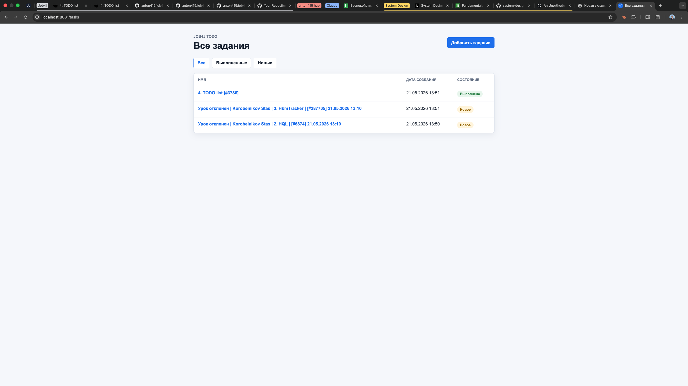
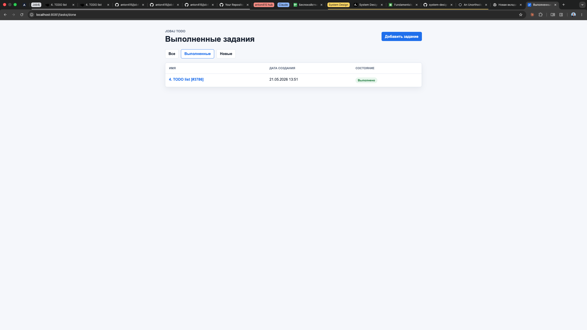
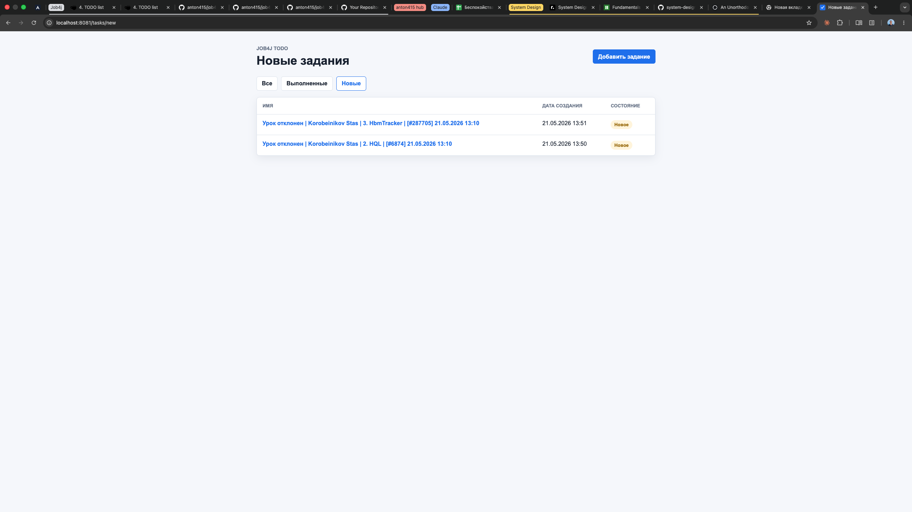

# Job4j Todo

Веб-приложение для ведения списка заданий. Задания можно создавать, просматривать, редактировать, удалять и переводить в состояние "Выполнено".

## Возможности

- список всех заданий;
- фильтры "Все", "Выполненные", "Новые";
- страница подробного описания задания;
- создание, редактирование, выполнение и удаление задания.

## Стек

- Java 17
- Spring Boot 2.7.3
- Thymeleaf
- Hibernate 5
- PostgreSQL
- Liquibase
- Maven

## Архитектура

Приложение разделено на три слоя:

- `controller` - обработка HTTP-запросов;
- `service` - бизнес-логика;
- `store` - работа с Hibernate `SessionFactory`.

`SessionFactory` создается один раз в `ru.job4j.todo.Main` через Spring `@Bean` и передается в `TaskStore` через конструктор.

## Запуск

Создайте базу данных PostgreSQL:

```bash
createdb todo
```

Проверьте параметры подключения в файлах:

- `db/liquibase.properties`
- `db/liquibase_test.properties`
- `src/main/resources/hibernate.cfg.xml`

По умолчанию используется:

```text
url=jdbc:postgresql://localhost:5432/todo
username=postgres
password=password
```

Запустите приложение:

```bash
mvn spring-boot:run
```

Liquibase выполнит миграцию из `db/scripts/001_ddl_create_tasks.sql` в фазе Maven `process-resources`.

После запуска приложение доступно по адресу:

```text
http://localhost:8080/tasks
```

## Скриншоты







